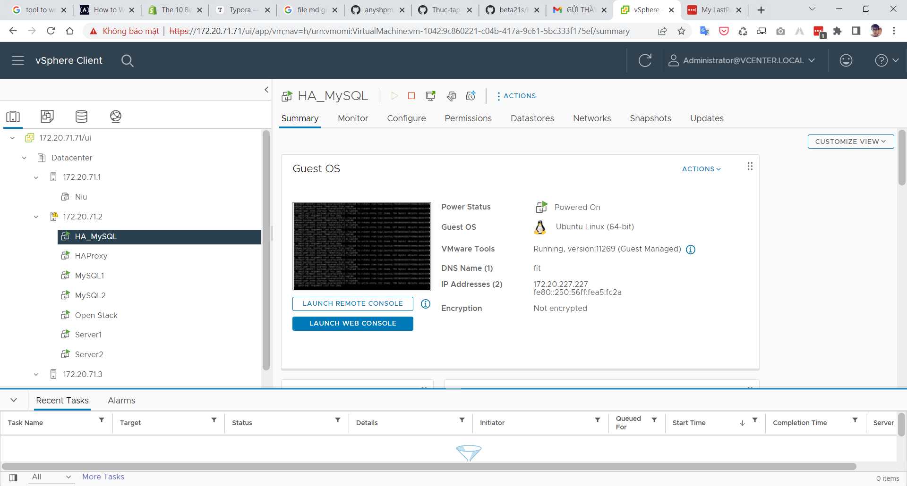
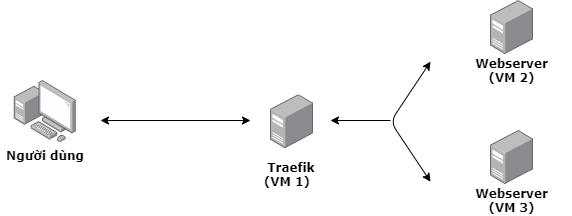

#### PHẦN 4 – CONTAINER HÓA MÁY CHỦ WEB 

##### **Câu 1: Thực hiện cài đặt và cấu hình Docker** 

###### Cài đặt Docker trên máy chủ Ubuntu 

Typing.....

###### Tìm hiểu khái niệm và thực hiện 1 ví dụ về Docker networking 

Typing.....

###### Tìm hiểu khái niệm và thực hiện 1 ví dụ về Docker storage (volumes) 

###### Tìm hiểu khái niệm và thực hiện 1 ví dụ về Dockerfile

######  Tìm hiểu khái niệm và thực hiện 1 ví dụ về Docker-compose 